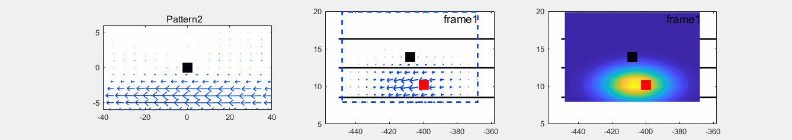
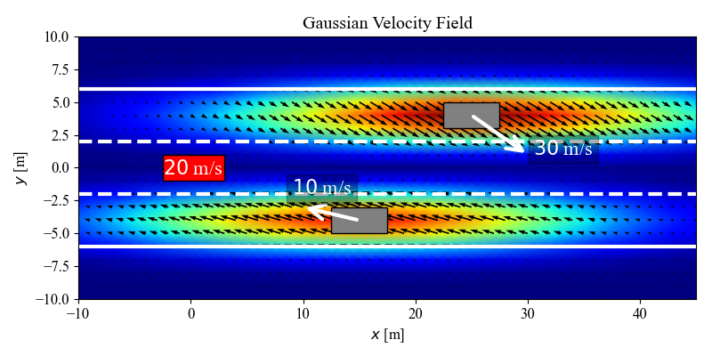

# Gaussian Velocity Field (GVF)


This repo provides a basic implementation of Gaussian Velocity Field.

## How to run

To visualize the result: ```python visualization.py```

<center>
  
</center>

## Note

- The hyperparameters for Gaussian Velocity Field are manually defined in this repo. One can either set the
  hyperparameters manually according to the specific scenarios or learn from the data.
- GVF in this repo is constructed based on the relative velocity, one can easily base this model on the absolute
  velocity.

## Paper

- **Project website: [[web](https://chengyuan-zhang.github.io/Multivehicle-Interaction/)].**
- **Access our paper
  via: [[arXiv](https://arxiv.org/pdf/2003.00759v2.pdf)] or [[paper](https://ieeexplore.ieee.org/document/9357407)].**
- **Watch the demos
  via: [[YouTube](https://youtu.be/AcyDn43hb7I)] or [[Bilibili](https://www.bilibili.com/video/BV1BD4y1m7VL/)].**
- **Also check the supplements via: [[Spatiotemporal_Appendix.pdf](./files/Spatiotemporal_Appendix.pdf)].**

If you find the codes or paper useful for your research, please cite our paper:

```tex
@article{zhang2021spatiotemporal,
      title={Spatiotemporal learning of multivehicle interaction patterns in lane-change scenarios},
      author={Zhang, Chengyuan and Zhu, Jiacheng and Wang, Wenshuo and Xi, Junqiang},
      journal={IEEE Transactions on Intelligent Transportation Systems},
      year={2021},
      publisher={IEEE}
}

@inproceedings{zhang2019general,
  title={A general framework of learning multi-vehicle interaction patterns from video},
  author={Zhang, Chengyuan and Zhu, Jiacheng and Wang, Wenshuo and Zhao, Ding},
  booktitle={2019 IEEE Intelligent Transportation Systems Conference (ITSC)},
  pages={4323--4328},
  year={2019},
  organization={IEEE}
}
```

## Contact

**If you have any questions please feel free to contact
us:  [Chengyuan Zhang](https://chengyuanzhang.wixsite.com/home) (<enzozcy@gmail.com>)
and [Wenshuo Wang](http://wenshuow.com/) (<wwsbit@gmail.com>).**